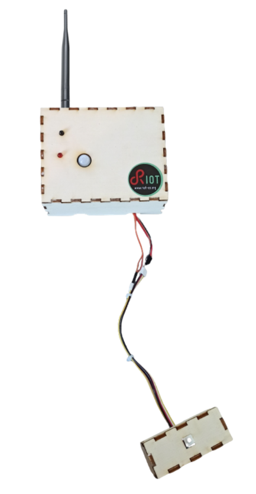

# Mini Projet IoT 2021-2022
# “Réseau de sirènes d’alarme LoRaWAN”

## Architecture globale du réseau de sirènes d’alarme

L’objectif est de développer un périphérique qui pourra être déployé en réseaux afin de récolter des informations sur plusieurs positions d’un même lieux (exemple entrepôt, pièce de vie, atelier etc…) ou sur différents lieux. Il permetra de pouvoir monitorer ces lieux, déclenche une alerte en cas de détection d'incendie ou en cas d'appuie sur un bouton. 

L'ensemble des informations sera récolté et sera visualisé sur un panneau de contrôle. 

## Sécurité de notre périphérique

Pour le développement de notre périphérique nous pouvons modifier la sécurité d'une partie. En effet, à partir de gateway nos données sont transmises par internet et donc chiffrées en équivalence. Ensuite l'accès au application tels que campus iot et mydevice la sécurité ce joue sur les mots de passe choisie.

La **partie de sécurité** sur laquelle nous pouvons intervenir est le chiffrage de la trame de donnée entre notre device et le serveur campus iot sur lequel on distribue ensuite l’information à mydevices. 

Pour la communication de notre trame nous avons choisi le mode de transmission OTAA (Over The Air Activation). 
Dans le protocole OTAA, on choisit une clé de 64 bits qui se trouve codé en dure dans notre devise et dans l’application. 
Pendant la procédure de “join”, 2 clés sont générées dynamiquement entre le périphérique et l’application, c’est 2 clés se nommant NwkSkey et AppSkey.

La NwkSkey, permet l’identification du message et empêche les attaques de type modification de message à la volé.

L'autre clé, AppSkey socupe de chiffrer point à point le message.  

## Architecture matérielle de l’objet :

## Estimer le coût de la BOM de votre produit
LoRa e5 Dev Board : 26.9$
Adjustable PIR Motion Sensor : 8.7$
Flame detector : 7.6$
Piezo Buzzer : 2.1$
Temp&Humi&Barometer Sensor (BME280) : 18.7$
Grove - Button : 2.1$ x2 
PCB : 4$ les 5
Prix pour 5000 : 26.9*5000 + 8.7*5000 + 7.6*5000 + 2.1*5000 + 18.7*5000 + 2.1*2*5000 + 4*5000/5

Prix total = $334500

Cette estimation ne tient pas compte des réductions possibles avec une commande de gros, de la main d'œuvre, du transport,   et ne tient pas compte de la certification.

## Certification des produits LoRaWAN
Une fois un produit créé, il est possible de le certifier notre device via la certification LoRaWAN®. 

L'intérêt de cette certification est de pouvoir garantir que notre appareil est fiable et conforme à la spécification  LoRaWAN®. De plus cette certification comprend la certification LoRaWANCM  qui est une preuve de qualité et permet de rassurer les potentiel acheteur. 

Pour finir avec la certification, notre produit sera promu dans le marketing de LoRa Alliance®.

**image**
La solution la moins chère est de devenire membre de LoRa alliance, en étant définie comme une startup, pour un prix de 3K$ par an nous pourrions certifié notre périphérique gratuitement.

## Implémentation du logiciel embarqué de l’objet défini
L’idée de la réalisation de notre objectif est de faire une alarme qui peut se déclencher sur plusieurs facteurs, détection de flamme, température trop élevée, hausse de la température normale ou activation manuel.

Lorsque l’alarme est déclenchée, un buzzer et une led effectue un signalement sonore et visuel. De plus, une information est transmise à un serveur permettant d'alerter des opérateurs immédiatement.

Afin de réaliser ceci nous pensons programmer une fonction main qui s’occupera de lancer plusieurs thread : 
- un pour le buzzer
- un pour le capteur de mouvement
- un pour la LED d’incendie
- un pour l’envoie des données

Les interrupteurs seront sur des interruptions ce qui nous évitera des crée de thread inutilement. 

Pour le capteur de flamme nous pouvons soir le mettre en interruption soit dans un thread car il possède une sortie analogique et une sortie digital avec un réglage de seuil par potentiomètre. Nous verrons une fois des tests effectuer qu’elle solution nous paraît la meilleure.

Pour la communication de l'ensemble des capteurs nous obtenons pour l’envoie de message entre les différents thread. Mais nous gardons la possibilité d’utiliser des variables globales si et seulement si une seule entité peut écrire à l'intérieur de celle-ci.

Nous avons décidés d’envoyer quelques informations en LoRa : 
- alarm : 0 ou 1 qui permet de savoir si l’alarme sonore est activé
- temp : valeur de la température de la pièce
- flame : 0 ou 1 qui permet de savoir si une flamme est détectée
- pres : 0 ou 1 qui permet de savoir si une personne est passée devant le détecteur depuis moins de 10 min
- btn_panic : 0 ou 1 qui permet de savoir si l'alarme a été activée par le bouton

Pour finir en fonctionnement normal nous enverrons à intervalle régulier les informations afin de vérifier si le capteur est toujours présent et opérationnel.

- fgg

