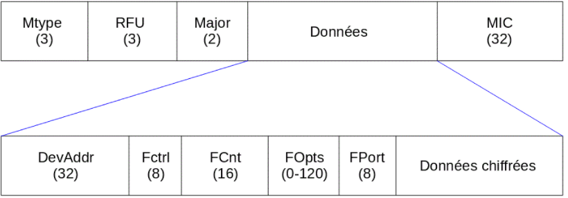

# Mini Projet IoT 2021-2022
# “Réseau de sirènes d’alarme LoRaWAN”
 

## Architecture globale du réseau de sirènes d’alarme

       L’objectif est de développer un périphérique qui pourra être déployé en réseaux afin de récolter des informations sur plusieurs positions d’un même lieux (exemple entrepôt, pièce de vie, atelier etc…) ou sur différents lieux. Il permetra de pouvoir monitorer ces lieux, déclenche une alerte en cas de détection d'incendie ou en cas d'appuie sur un bouton. 

L'ensemble des informations sera récolté et sera visualisé sur un panneau de contrôle. 

## Sécurité de notre périphérique

       Pour le développement de notre périphérique nous pouvons modifier la sécurité d'une partie. En effet, à partir de gateway nos données sont transmises par internet et donc chiffrées en équivalence. Ensuite l'accès au application tels que campus iot et mydevice la sécurité ce joue sur les mots de passe choisie.

       La **partie de sécurité** sur laquelle nous pouvons intervenir est le chiffrage de la trame de donnée entre notre device et le serveur campus iot sur lequel on distribue ensuite l’information à mydevices. 

       Pour la communication de notre trame nous avons choisi le mode de transmission OTAA (Over The Air Activation). 
Dans le protocole OTAA, on choisit une clé de 64 bits qui se trouve codé en dure dans notre devise et dans l’application. 
Pendant la procédure de “join”, 2 clés sont générées dynamiquement entre le périphérique et l’application, c’est 2 clés se nommant NwkSkey et AppSkey.

       La NwkSkey, permet l’identification du message et empêche les attaques de type modification de message à la volé.

       L'autre clé, AppSkey socupe de chiffrer point à point le message.  

## Architecture matérielle de l’objet :

## Estimer le coût de la BOM de votre produit
</dev>
LoRa e5 Dev Board : 26.9$ 
Adjustable PIR Motion Sensor : 8.7$ 
Flame detector : 7.6$ 
Piezo Buzzer : 2.1$ 
Temp&Humi&Barometer Sensor (BME280) : 18.7$ 
Grove - Button : 2.1$ x2  
PCB : 4$ les 5 
Prix pour 5000 : 26.9*5000 + 8.7*5000 + 7.6*5000 + 2.1*5000 + 18.7*5000 + 2.1*2*5000 + 4*5000/5 

Prix total = $334500 

       Cette estimation ne tient pas compte des réductions possibles avec une commande de gros, de la main d'œuvre, du transport,   et ne tient pas compte de la certification.

## Certification des produits LoRaWAN
       Une fois un produit créé, il est possible de le certifier notre device via la certification LoRaWAN®. 

       L'intérêt de cette certification est de pouvoir garantir que notre appareil est fiable et conforme à la spécification  LoRaWAN®. De plus cette certification comprend la certification LoRaWANCM  qui est une preuve de qualité et permet de rassurer les potentiel acheteur. 

       Pour finir avec la certification, notre produit sera promu dans le marketing de LoRa Alliance®.

**image**
       La solution la moins chère est de devenire membre de LoRa alliance, en étant définie comme une startup, pour un prix de 3K$ par an nous pourrions certifié notre périphérique gratuitement.

## Implémentation du logiciel embarqué de l’objet défini
	
       L’idée de la réalisation de notre objectif est de faire une alarme qui peut se déclencher sur plusieurs facteurs, détection de flamme, température trop élevée, hausse de la température normale ou activation manuel.

       Lorsque l’alarme est déclenchée, un buzzer et une led effectue un signalement sonore et visuel. De plus, une information est transmise à un serveur permettant d'alerter des opérateurs immédiatement.

       Afin de réaliser ceci nous pensons programmer une fonction main qui s’occupera de lancer plusieurs thread :  
       - un pour le buzzer 
       - un pour le capteur de mouvement 
       - un pour la LED d’incendie 
       - un pour l’envoie des données 

       Les interrupteurs seront sur des interruptions ce qui nous évitera des crée de thread inutilement. 

       Pour le capteur de flamme nous pouvons soir le mettre en interruption soit dans un thread car il possède une sortie analogique et une sortie digital avec un réglage de seuil par potentiomètre. Nous verrons une fois des tests effectuer qu’elle solution nous paraît la meilleure.

       Pour la communication de l'ensemble des capteurs nous obtenons pour l’envoie de message entre les différents thread. Mais nous gardons la possibilité d’utiliser des variables globales si et seulement si une seule entité peut écrire à l'intérieur de celle-ci.

       Nous avons décidés d’envoyer quelques informations en LoRa :  
              - alarm : 0 ou 1 qui permet de savoir si l’alarme sonore est activé 
              - temp : valeur de la température de la pièce 
              - flame : 0 ou 1 qui permet de savoir si une flamme est détectée 
              - pres : 0 ou 1 qui permet de savoir si une personne est passée devant le détecteur depuis moins de 10 min 
              - btn_panic : 0 ou 1 qui permet de savoir si l'alarme a été activée par le bouton 

       Pour finir en fonctionnement normal nous enverrons à intervalle régulier les informations afin de vérifier si le capteur est toujours présent et opérationnel.

## Définir le format LPP des messages LoRaWAN uplink et downlink

Source : https://docs.mydevices.com/docs/lorawan/cayenne-lpp

       Nous envoyons cinq données : 4 de type digital et une température comme le montre la capture d’écran suivante : 

Sur le channel 0 nous avons un byte pour fire.
Sur le channel 2 nous avons deux bytes pour la température.
Sur le channel 2 nous avons un byte pour le capteur de présence.
Sur le channel 3 nous avons un byte pour flame.
Sur le channel 4 nous avons un byte pour btn_panic.

       En nous basant sur une trame de donnée, nous avons à chaque envoie 152 bits à envoyer, avec le spreading factor le plus élevé nous occuperons 16ms. Pour respecter un ratio de 10% de discussion sur 90% d’écoute nous devons transmettre toutes les 160ms au maximum. Nous communiquerons donc au maximum toutes les 2 min sachant que nous n'avons pas forcément le spreading factor le plus élevé.

## Le logiciel embarqué de notre l’objet sirène

       De façon globale, l'implémentation que nous avons réalisée correspond à la spécification que nous avons définie plus haut. Toutefois nous avons ajouté des améliorations.

       Pour commencer l'ensemble du code ce trouve dans le fichier main.c, toutefois nous avons créé des fichier d'en tête pour chaque composant. Ces fichiers, qui se trouvent dans le dossier "Include", contiennent la définition des pins physiques des objets ainsi que les différents delay utilisés pour chaque capteur. Cela permet un accès rapide afin de pouvoir effectuer des modifications simplement.

       Pour le capteur de flamme nous avons opté pour un thread car cela nous permettra de modifier la valeur de seuil de façon plus simple sans avoir à faire des modification matériel.

       La fonction capteur de présence indique si une personne était présente il y a moins de 10min ce qui pourra permettre au secour de savoir s’il y a une notion de victimes.

       De plus, nous avons commencé l’intégration de réception de message afin de pouvoir régler des paramètres à distance. Pour cela nous avons ajouté 3 canaux de communication. Un canal digital pour le déclenchement à distance de l’alarme et 2 canaux analogique pour le réglage de l’intervalle d’envoie des données or urgence et pour le réglage de la valeur de seuil du capteur de flamme. 
Ceci implique que dans notre main nous aurions une fonction de lecture permanente de données. Ce qui force notre dispositif à être en classe C.

       Cependant, malgré que nous somme arriver à mettre ces nouveaux canaux sur mydevices et à récupérer des données sur la carte lora à partir de campus iot nous ne parvenons à envoyer les données depuis notre Dashboard cela serait une idée d’amélioration.

       Pour finir nous avons implémenté un define qui nous permet d'être en mode débug, c’est à dire que l'ensemble des print mis dans le code seront opérationnels si ce define est activé. L'intérêt de mettre un définie, est que celui qui n’est pas activé à la compilation l'ensemble du code servant au fonction d’affichage ne sera pas ajouté. Notre code ne sera donc pas plus lourd. 

       En amélioration possible il sera possible d’alimenter le dispositif via le secteur et d’avoir une batterie permettant de prendre le relais en cas de coupure.

## Métriques logiciel du logiciel embarqué (nombre de lignes de code, taille du binaire du firmware ie le fichier .bin)

       Notre logiciel embarqué possède un grand nombre de lignes de code car il contient l'ensemble de l’os Riot ainsi que les drivers c’est pourquoi pour les métriques suivantes nous indiquerons uniquement ce que nous avons fait. Bien entendu la taille du binaire sera celle qui contient l'ensemble de notre logiciel embarqué.

       Pour notre programme nous avons donc 8 fichiers, le main et l'ensemble des .h permettant de définir certaines données sur nos composants nous permettant de les modifier facilement. 
       Le tout est composé de 737 lignes. 

       Une fois le projet compilé il fait 54.2Ko

## Graphique des fonctionnalités

       En fonctionnement normal, seul le capteur de présence et les deux boutons poussoirs sont activés. En effet, le capteur de présence va lancer un timer lorsqu’il détecte quelqu’un pour savoir si, dans le cas où il y ait un incendie, on puisse savoir depuis combien de temps une personne est passée dans la pièce.

       Si le bouton panic est utilisé alors le système passe en mode incident détecté et met en marche l’alarme sonore (buzzer) et l’alarme visuelle (LED). Le système va également envoyer l’information qu’une personne est présente ou non.
       Enfin, si le système est en mode incident détecté et que le bouton user est activé, le système repasse en mode normal et arrête les alarmes.

       Voici une trace des données dans différent cas. Cependant nous nous trouvions trop loin des Gateway donc la partie communication ne fonctionne pas.

## Consommation de notre périphérique 

       Comme dit précédemment notre dispositif doit être en classe C, la classe b est envisageable en ajoutant par exemple un module RTC et en envoyant les informations sur certaines plages horaires précises.

       En utilisant le calculateur donné, et en sélectionnant un capteur de mouvement ainsi que la capacité de deux piles, on obtient une durée de vie située entre 9 et 10 mois avec le spreading factor 12.

## Analyse du cycle de vie du produit

       L'analyse du cycle de vie (ACV) est une méthode d'évaluation normalisée (ISO 14040 et 14044) permettant de réaliser un bilan environnemental multicritère et multi-étape d'un système (produit, service, entreprise ou procédé) sur l'ensemble de son cycle de vie.
       Son but est de connaître et pouvoir comparer les impacts environnementaux d'un système tout au long de son cycle de vie, de l'extraction des matières premières nécessaires à sa fabrication à son traitement en fin de vie (mise en décharge, recyclage…), en passant par ses phases d'usage, d'entretien et de transport.

       Dans notre projet, il faudra alors prendre en compte le coût de fabrication des composants en termes de matières premières, de déchets et des émissions.

## Analyse des produits concurrents

## Solutions utilisables pour localiser l’objet sirène

       Pour la localisation des objets plusieurs solution sont envisageable, utilisation du module gps permettant d’envoyer la position de l'objet via le lora en utilisant  cayennelpp_add_localisation mais cela utilise 27Bytes (9 par metrique : longitude, latitude et altitude).

       D'autres solutions moins gourmandes en énergie telles que la triangulation avec des gateway. Pour avoir une position précise il nous faudrait au moins 3 gatways et le temps de transmission. A partir du débit nous pourrions donc avoir la distance entre le périphérique et chaque antenne.

## Intégration cayenne

## Annexes

**Plans de la boîte**

	

